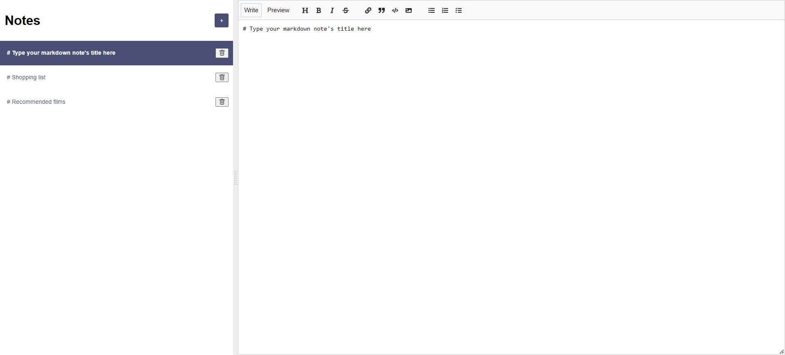

# React notes app - Learn React Project from Scrimba

This is a project for the 'Learn React' course from Scrimba.

## Screenshot

## Links

- Live Site URL: https://main--cl4ram-react-notes-app.netlify.app/

## My process

- useState and useEffect
- Conditional rendering
- React mde

## To-do

- ~~Implement Firebase~~
- Update styles
